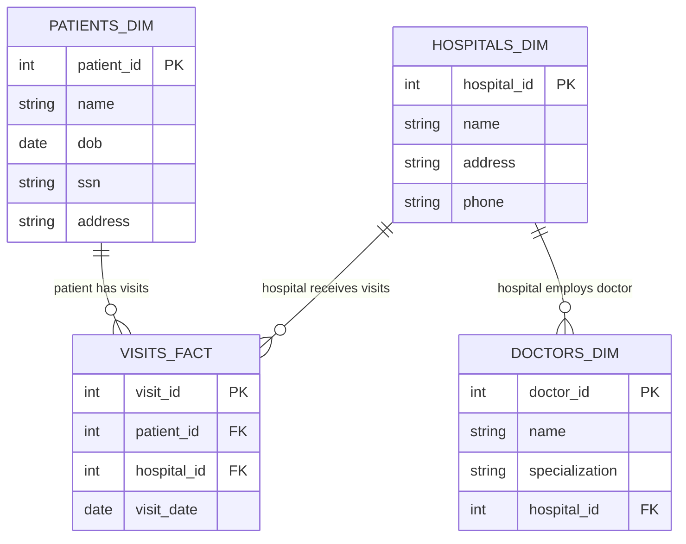

**Developers need realistic data for testing and development.** Using production data for this purpose poses a security risk. Mitigation of this risk is especially important in tightly regulated sectors, such as in the medical sector, insurance, or in finance.

**Data anonymization** is a way to make realistic data available in a development workspace for engineers to work with.

Even though the data is anonymized, several issues may cause developers to still **accidentally expose sensitive information**:

- Schema changes can reintroduce sensitive data.
- Improper access controls can lead to data leaks.
- Anonymization mistakes can result in re-identification.

The goal of this article is to introduce the necessary steps to creata a secure, automated pipeline to anonymize production data while ensuring **privacy, compliance, and security**.

🔗 A fully working example pipeline can be found on [GitHub](https://github.com/luijkr/data-anonymization-databricks){:target="_blank"}. This pipeline implements all steps outlined below. Any code referenced in this article is included in this repository.
{:.note title="code availability"}

---

## 1️⃣ Step 1: Generating Tables and Data

### Generating Synthetic Data

For this example pipeline, we will generate synthetic data using [Faker](https://faker.readthedocs.io/en/master/){:target="_blank"}. The data consists of hospital visits by patients. Each visit is associated with a patient, a hospital, and a doctor. It consists of a few tables that are structured using a [star schema](https://www.databricks.com/glossary/star-schema){:target="_blank"}.

- `fact_visits`: All visits to hospitals by patients.
- `dim_patients`: Patient data, such as patient name and date of birth.
- `dim_hospitals`: Hospital contact information, such as address.
- `dim_doctors`: Information about the doctors, such as their specialization.

Visually, we can represent the tables as follows.



### Separating the Original Data and the Anonymized Data

In our scenario, we want to efficiently make anonymized production data available in a development workspace. To prevent any copying of sensitive data, we can **make use of [catalog bindings](https://learn.microsoft.com/en-us/azure/databricks/catalogs/binding){:target="_blank"}** within Databricks to allow *read only* permissions within the development workspace of the anonymized production catalog. Note that the original production data never gets made accessible to the development workspace!

{: width="75%" style="display: block; margin: 0 auto" }
Only the anonymized production data gets shared with a development workspace.
{:.figure}

In the example pipeline, we don't have separate workspaces, as we're just focusing on the anonymization process. Instead, we will use one "production" workspace with two catalogs representing the original data and the anonymized data: `medical` and `medical_anonymized`, as in the image above. Each of these two catalogs contains a schema named `visits`.
{:.note title="workspaces, catalogs, and schemas"}

### Creating Tables in the Two Catalogs

The anonymized data should mirror the exact structure of the original data. We will create empty tables in `medical_anonymized` catalog to reflect the exact structure of the original data in the `medical` catalog. This includes **maintaining proper primary keys and foreign keys** to indicate referential integrity.

Together, the above two steps prevent direct exposure of production data, and allows development without handling real sensitive data.

```sql
CREATE OR REPLACE TABLE ${catalog_name}.${schema_name}.dim_patients (
    patient_id INT PRIMARY KEY,
    name VARCHAR(255) NOT NULL,
    dob DATE NOT NULL,
    ssn VARCHAR(20) NOT NULL,
    address STRING NOT NULL
);
```

---

## 2️⃣ Step 2: Applying Proper Permissions

To further reduce the risk of accidental data exposure, we enforce the [principle of least privilege](https://learn.microsoft.com/en-gb/azure/databricks/lakehouse-architecture/security-compliance-and-privacy/best-practices){:target="_blank"}. This ensures **only authorized users** can interact with the anonymized dataset. What does this look like in practice? 

For the original production catalog, this means:

- Grant access to the original production data **only to a service principal** used for automated jobs doing the anonymization.

```sql
-- REVOKE all privileges by default
REVOKE ALL PRIVILEGES ON CATALOG medical FROM `account users`;

-- GRANT
GRANT USAGE ON CATALOG medical TO `my_service_principal`;
GRANT SELECT ON SCHEMA medical.visits TO `my_service_principal`;
```

In the development environment:

- **Revoke all permissions** initially. This prevents accidentally granting too many permissions.
- Grant access **only to a specific group of users**, such as a developers group.

```sql
-- REVOKE
REVOKE ALL PRIVILEGES ON CATALOG medical_anonymized FROM `account users`;

-- GRANT
GRANT USAGE ON CATALOG medical_anonymized TO `developers`;
GRANT SELECT ON SCHEMA medical_anonymized.visits TO `developers`;
```

---

## 3️⃣ Step 3: Preventing Schema Changes That Reintroduce Sensitive Data

We have followed the principle of least privilege to limit the privileges the users have on the original and anonymized data. However, **schema changes can still cause accidental exposure** of sensitive data. For example, through the introduction of new sensitive fields in production. To mitigate this, we rely on both built-in tools and a manual approach.

### Automatic Schema Enforcement

Databricks provides two built-in ways to guard against schema changes.
- **Automatic [schema enforcement](https://learn.microsoft.com/en-gb/azure/databricks/tables/schema-enforcement){:target="_blank"}** of Delta tables. Inserting data that does not match the target tables' schema will result in an error. Merging data into a table yields the same result — though it is possible to use [`MERGE WITH SCHEMA EVOLUTION`](https://learn.microsoft.com/en-us/azure/databricks/sql/language-manual/delta-merge-into){:target="_blank"}.
- Disabling [column mapping](https://learn.microsoft.com/en-us/azure/databricks/delta/column-mapping){:target="_blank"} prevents metadata-only changes to the table schema.

### Manual Schema Validation

To even further reduce the risk of schema changes, we use **schema validation** prior to data loading. For every table, we compare the schemas between production and development data. Any new or modified columns will be flagged for review through alerts. Approving any schema changes should be peer-reviewed and deployed through CI/CD pipelines — again to minimize the need for manual interference.

Schema validation can be done in various ways. Either by manually comparing the schemas of the original data and the anonymized data, or using tools like [Great Expectations](https://github.com/great-expectations/great_expectations){:target="_blank"}.

The combination of automatic and manual schema validation prevents accidental exposure of new sensitive fields added in production. Furthermore, it ensures **only approved schema updates** are propagated to development.

---

## 4️⃣ Step 4: Hashing and Secrets for Secure Anonymization

### Hashing and Anonymization

Our application requires referential integrity to be maintained. In addition, some sensitive data such as names should still be unique and usable. As a result, [row-level filters and column-level masks](https://learn.microsoft.com/en-us/azure/databricks/tables/row-and-column-filters){:target="_blank"} will not suffice. Instead, we need **hashing to prevent direct exposure of sensitive data**.

Databricks has various hashing functions built in, such as [MD5](https://learn.microsoft.com/en-us/azure/databricks/sql/language-manual/functions/md5), [SHA1](https://learn.microsoft.com/en-us/azure/databricks/sql/language-manual/functions/sha1){:target="_blank"}, and [SHA2](https://learn.microsoft.com/en-us/azure/databricks/sql/language-manual/functions/sha2){:target="_blank"}. Of these functions, **SHA256 provides the best security** and lowest chance of [collisions](https://en.wikipedia.org/wiki/Hash_collision){:target="_blank"} — a phenomenon when two different inputs result in the exact same hash.

### Secret Salt

While SHA256 is already secure, we will **add another layer of security by adding [salt](https://en.wikipedia.org/wiki/Salt_(cryptography)){:target="_blank"}** — a random string added to any input. Adding salt makes it more difficult to crack a hashing function because it prevents predictable hashes. Because salt is used to make attacks less likely to be successful, we need to carefully **store this secret salt in a well-managed location** — never hardcode it in your notebooks! We store this random string in [Databricks secrets](https://learn.microsoft.com/en-us/azure/databricks/security/secrets/){:target="_blank"}. Note that a longer string is better.

```bash
# Create a new scope
databricks secrets create-scope data-anonymization

# Put the secret salt in the newly create scope
databricks secrets put-secret --json '{
  "scope": "data-anonymization",
  "key": "secret-salt",
  "string_value": "HdCeX8SPLwmR56lPUL10"
}'
```

This secret can be used in any notebook, as long as we have access to it. We can retrieve this secret in our code using `dbutils`. 

```python
secret_salt = dbutils.secrets.get(
    scope="data-anonymization",
    key="secret-salt"
)
```

Fortunately, Databricks automatically redacts the secret if you try to print it.

{: width="75%" style="display: block; margin: 0 auto" }
Databricks automatically redacts secrets.
{:.figure}

### Anonymization While Retaining Column Data Types

It is possible to hash a column of any data type, but the result will always be a string. To maintain our schema exactly as it is—including data types—we need to use different methods. Depending on the data type, various strategies can be used. In this case, we will focus on anonymizing integer and date columns. For both types, we will use the [modulo operation](https://en.wikipedia.org/wiki/Modulo){:target="_blank"}.

#### Integer Type

To generate an anonymized integer value from a given integer input, follow these steps:

1. Calculate the hash of the integer input, optionally adding salt before hashing.
2. Apply the modulo operator to obtain a (semi-)random integer.
3. Ensure that the new integer is non-negative.

```python
def anonymize_integer(column_name: str, max_value: int = 1000000) -> F.col:
    """Anonymize an integer column by hashing and taking modulo."""
    max_modulo_number = ceil(max_value / 2)
    salted_column = add_salt(column_name)
    anonymized_integer = (F.hash(salted_column) % max_modulo_number).cast("int")

    # Ensure the anonymized integer is non-negative
    anonymized_integer = anonymized_integer + F.lit(max_modulo_number)
    return anonymized_integer
```

#### Date Type

For date types, we will shift the original date by a maximum of one year. This again involves hashing the date and using the modulo operator to determine a random number of days. We then shift the original date by this calculated number of days, ensuring that the resulting date does not fall in the future.

```python
def anonymize_date(column_name: str, max_days_shift: int = 365) -> F.col:
    """Anonymize a date column by adding a random number of days."""
    max_modulo_days = ceil(max_days_shift)
    salted_column = add_salt(column_name)

    # Generate a random number of days to shift the date from -max_days_shift to +max_days_shift
    random_days = (F.hash(salted_column) % max_modulo_days).cast("int")

    # Ensure the random days are non-negative to avoid future dates
    day_shift = random_days - F.lit(max_days_shift)
    return F.date_add(column_name, day_shift)
```

---

## 5️⃣ Step 5: Applying Tags for Metadata Management

[Column tags](https://learn.microsoft.com/en-us/azure/databricks/sql/language-manual/information-schema/column_tags){:target="_blank"} help classify and track sensitive fields across the pipeline, and improve governance by helping enforce data policies.

To indicate which columns contain sensitive data or primary or foreign keys, we will use [column tags](https://learn.microsoft.com/en-us/azure/databricks/sql/language-manual/information-schema/column_tags){:target="_blank"}. Properly tagging each column enables us to use an automated job to perform data anonymization.

Tagging columns manually is time-consuming. In our example pipeline, we will automate column tagging based on:

- Field names. *E.g.*, tag columns containing the words `email` or `phone_number` as PII.
- Use table metadata to select primary and foreign keys. Alternatively, we could again use pattern matching to select columns containing *_id*, for example.

```python
# Tagging example here
```

---

## 6️⃣ Step 6: Performing Sanity Checks on Anonymized Data

Each step so far has focused on anonymizing production data in an efficient and secure manner, safeguarded by various checks. As a final step in the pipeline, we will perform some basic sanity checks to make sure the structure of the data is indeed as we expect. This way, we ensure that anonymization does not break the dataset structure, and prevents data corruption in the development workspace.

- **Check record counts:** Ensure data volume is consistent post-anonymization.
- **Verify referential integrity:** Confirm that primary/foreign key relationships are maintained.

## 7️⃣ Step 7: Rollback in Case of Failure

Suppose any one of the steps in the pipeline fails, then what?

### Time Travel

One way of restoring the previous data is by **enabling and using [time travel](https://learn.microsoft.com/en-gb/azure/databricks/delta/history){:target="_blank"}**. A quick and simple SQL query will do the trick.

```sql
RESTORE TABLE my_table TO VERSION AS OF <latest-version>;
```

However, this has **one major downside**. We have **already exposed the wrong data**. If the rollback also fails, then we are left with a dataset that does not meet our expectations. We would have to manually go in and fix the issue.

### Staging Tables

A better alternative is to use staging tables. That means that instead of directly writing to the development environment catalog that is available for use, we first stage the results in intermediate tables. Those staging tables can then also be used to perform the sanity checks defined in step 6.

```
# DIAGRAM HERE
# PROD_CATALOG -> DEV_CATALOG
# PROD_CATALOG -> STAGING -> DEV_CATALOG
```

After all checks have successfully performed all checks and we are certain the data is correct, we can then move those over to the final location in the development environment. How we do this depends on the source data. This could either be a full load, overwriting the existing data, or we could merge the staging table in the final anonymized table.

---

## 💻 Automating the Entire Process with a Secure Pipeline

This article describes a lot of steps that need to be regularly executed in order to keep the anonymized development data up to date. This [GitHub repository](https://github.com/luijkr/data-anonymization-databricks){:target="_blank"} provides a [Databricks Asset Bundle](https://learn.microsoft.com/en-us/azure/databricks/dev-tools/bundles/){:target="_blank"} that contains a few jobs.

1. Setup synthetic data
    - Generate synthetic data that mimicks the production environment.
    - Create tables in a development catalog.
    - The appropriate, stringent permissions are set on the tables in the production and development catalogs.
2. Apply column tags in the production catalog.
3. Anonymization
4. Anonymize the data from the production catalog, and store these in staging tables in the developoment catalog.
5. Perform sanity checks to validate that the data structure in development matches the structure in production.
6. Move the data in the staging tables into the final tables ready for use.
7. Optionally: perform rollback in case the pipeline fails
- **Use Databricks Workflows** to automate each step.
- **Integrate with Git for schema change approvals** (manual review process).
- **Implement notifications** (email/Slack alerts) for changes requiring approval.
- **Why is this important?**
    - **Minimizes manual errors** by automating checks and approvals.
    - Provides a **transparent, auditable** way to manage schema evolution.

```
# example job notification

resources:
  jobs:
    Master_Load:
      name: Master Load
      email_notifications:
        on_failure:
          - user@example.com
```

---

## 🔒 Wrapping Up: Ensuring a Secure Development Environment

Development environments may not always contain **data good enough to properly test business logic** and develop data pipelines. This article explored the necessary steps to **give developers access to realistic data**, while ensuring **sensitive information remains protected**. The approach described here **balances usability and security**. This ensures compliance without blocking development.

### Key Takeaways

- Never expose production data directly—always **anonymize first**.
- Use **least privilege access** to control who can interact with sensitive data.
- **Prevent schema drift** from reintroducing sensitive fields.
- Implement **automated sanity checks** to validate anonymized data.

### Next Steps

This article does not cover a few things.

- Use Git-based approvals to **control schema updates securely**.
- Ensure compliance with **internal policies and industry regulations**, as these are highly specific.

---

## 💡 Try It Yourself: Repository Overview


Interested in implementing this in your own Databricks environment?

🔗 **Check out the full pipeline in this [GitHub repository](https://github.com/luijkr/data-anonymization-databricks){:target="_blank"}.**
{:.note title="try it yourself!"}
