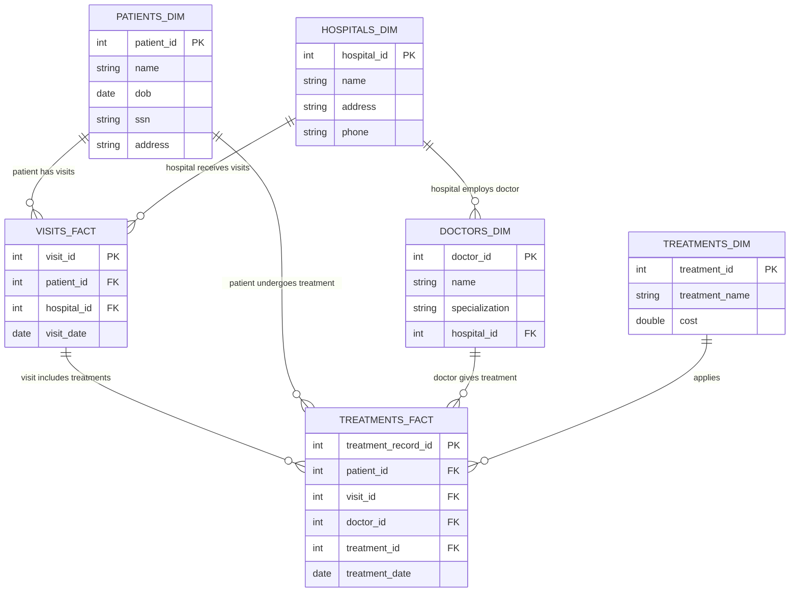

Data anonymization is essential for protecting sensitive information. Databricks provides features such as [row filters and column masks](https://learn.microsoft.com/en-us/azure/databricks/tables/row-and-column-filters) that allow for filtering tables or masking specific columns containing sensitive data. However, these options do not cover all scenarios. When handling relational datasets, it is important to maintain the relationships between tables while replacing or masking sensitive data.

In this article, we will explore a use case where we need to anonymize a dataset consisting of multiple tables while preserving their interrelationships. We will demonstrate how to achieve this in Databricks by using column tags to identify personally identifiable information (PII) and primary keys. Additionally, we will discuss both manual and automated methods for tagging and anonymizing data.

💡 All code used in this post is [available on GitHub](https://github.com/luijkr/data-anonymization-databricks/). This repos also includes a full pipeline in Databricks that performs all of the steps described below in succession.
{:.note title="code availability"}

## 💡 Setting the Context

Our objective is to anonymize data in a production workspace and make the anonymized version available in a development workspace. Several requirements must be met:

- The anonymized data must be untraceable to any production data.
- The relationships between tables must be preserved.
- The solution should be scalable to accommodate any number of tables and columns.

To accomplish this, we will utilize [column tags](https://learn.microsoft.com/en-us/azure/databricks/sql/language-manual/information-schema/column_tags) in Databricks.

## 🏥 Generating Medical Data

To demonstrate the process of automatically tagging and anonymizing data, we will generate synthetic data using the Python package [Faker](https://faker.readthedocs.io/).

The data is organized in a star schema, comprising the following dimensional tables:

- Patients (`dim_patients`)
- Doctors (`dim_doctors`)
- Treatments (`dim_treatments`)
- Hospitals (`dim_hospitals`)

Additionally, there are two fact tables that describe:

- Patient visits to hospitals (`fact_visits`)
- Treatments administered by doctors to patients (`fact_treatments`)

The Entity-Relationship diagram below illustrates the connections between these tables. Detailed SQL statements for creating the tables, along with the [definitions of](https://github.com/luijkr/data-anonymization-databricks/blob/main/notebooks/create_tables.sql) primary and foreign keys that establish these relationships, can be found [here](https://github.com/luijkr/data-anonymization-databricks/blob/main/notebooks/create_tables.sql).



## ❗ Importance of Column Tagging for Efficient Anonymization

To meet the outlined requirements, we will utilize [column tags](https://learn.microsoft.com/en-us/azure/databricks/sql/language-manual/information-schema/column_tags) in Databricks to specify which columns need anonymization and which contain primary or foreign keys that must be preserved.

Column tagging allows us to identify columns that contain sensitive data or keys, such as primary and foreign keys. By properly tagging each column, we can:

- Identify and anonymize personally identifiable information (PII) while maintaining usability—ensuring that each value remains unique rather than merely masked.
- Protect primary and foreign keys to uphold referential integrity.
- Streamline automated processing for anonymization workflows.

Through column tagging, we can leverage this metadata to apply various anonymization techniques (e.g., hashing) while ensuring that referential integrity is maintained.

## 🏷️ Using Column Tags in Databricks

Databricks supports column-level tags, enabling us to label specific columns within Unity Catalog. This metadata can then be utilized to programmatically enforce anonymization rules.

### Applying Column-Level Tags

To apply tags to a specific column, use the `ALTER TABLE` command to set key-value pairs or to specify a key without a corresponding value. For illustration, let’s consider one of the previously defined tables.

```sql
-- Sets a single key without a value
ALTER TABLE anonymization.medical.dim_patients
ALTER COLUMN patient_id SET TAGS ('is_key');

-- Sets a key-value pair
ALTER TABLE anonymization.medical.dim_patients
ALTER COLUMN name SET TAGS ('is_pii' = 'true');
```

Viewing the metadata for this table, we see the appropriate key and key-value pairs have been applied.


## ⚙️ Automating the Tagging Process

Manually tagging columns in numerous tables is not scalable. Instead, we should aim to automate this process using a combination of two approaches:

- A simple heuristic: If a column name includes terms like *name* or *address*, we will consider it to contain Personally Identifiable Information (PII).
- Using previously defined primary and foreign keys: These keys are stored in the [Information Schema](https://learn.microsoft.com/en-us/azure/databricks/sql/language-manual/sql-ref-information-schema). Alternatively, we can apply another heuristic, such as identifying column names that contain *id*, *pk*, or *fk*.

In our pipeline, we will first use the simple heuristic to identify columns that likely contain PII. Next, we will leverage the data in the Information Schema to select relevant columns. Finally, we will implement additional logic to dynamically create and execute `ALTER TABLE` statements to apply the appropriate tags.

The complete code for this step can be found in [column_tagging.py](https://github.com/luijkr/data-anonymization-databricks/blob/main/notebooks/column_tagging.py).

```python
def create_tag_sql_query(table_identifier: str, column_name: str, tag: str) -> str:
    """Returns a SQL query to add a tag to a column."""
    return f"ALTER TABLE {table_identifier} ALTER COLUMN {column_name} SET TAGS ('{tag}')"

def add_tags(table_identifier: str, column_names: list[str], tag: str) -> None:
    """Add tags to columns in a DataFrame."""
    for column_name in column_names:
        query = create_tag_sql_query(table_identifier, column_name, tag)
        spark.sql(query)
```

After automatically tagging the tables, the tags are visible in Databricks.


## 👤 Data Anonymization

We are now prepared to perform data anonymization, having established the necessary tags and generated fake data.

A key requirement of our solution is to preserve relationships between tables. Any `JOIN` operations performed on the original data must yield the same results when applied to `JOIN`the anonymized data. We achieve this through hashing. Specifically, we will apply the SHA256 hash to both primary and foreign keys, as well as any personally identifiable information (PII). The resulting DataFrame will be saved to a new schema.

```python
def anonymize_table(df: DataFrame, column_names: list[str]) -> DataFrame:
    """Anonymize columns in a DataFrame."""
    return df.select(
        *[
            F.expr(f"sha2(cast({c} as string), 256)").alias(c)
            if c in column_names
            else F.col(c)
            for c in df.columns
        ]
    )
```

The complete code for this step is available in [anonymized_data.py](https://github.com/luijkr/data-anonymization-databricks/blob/main/notebooks/anonymize_data.py). This code applies the same hashing function to all columns, which is crucial for transforming the keys and maintaining the relationships between tables.

## ✅ Validating the Anonymization Process

After completing the anonymization, we must validate the results to ensure that the original and anonymized data have identical structures. Basic checks include:

- Ensuring that the row counts remain unchanged between the original and anonymized datasets.
- Confirming that join operations between tables still function and produce the same row count.
- Verifying that no PII data can be recovered.

For example, the [validate_results.sql](https://github.com/luijkr/data-anonymization-databricks/blob/main/notebooks/validate_results.sql) file checks the row counts for all dimensional tables.

```sql
WITH
    stats AS (
        SELECT
            (SELECT COUNT(*) FROM ${catalog_name}.${schema_name}.dim_doctors) AS num_docs,
            (SELECT COUNT(*) FROM ${catalog_name}.${schema_name_anonymized}.dim_doctors) AS num_docs_anon,

            (SELECT COUNT(*) FROM ${catalog_name}.${schema_name}.dim_patients) AS num_patients,
            (SELECT COUNT(*) FROM ${catalog_name}.${schema_name_anonymized}.dim_patients) AS num_patients_anon,

            (SELECT COUNT(*) FROM ${catalog_name}.${schema_name}.dim_treatments) AS num_treatments,
            (SELECT COUNT(*) FROM ${catalog_name}.${schema_name_anonymized}.dim_treatments) AS num_treatments_anon,

            (SELECT COUNT(*) FROM ${catalog_name}.${schema_name}.dim_hospitals) AS num_hospitals,
            (SELECT COUNT(*) FROM ${catalog_name}.${schema_name_anonymized}.dim_hospitals) AS num_hospitals_anon
  )
SELECT
    assert_true(num_docs = num_docs_anon, 'Unequal number of rows in `dim_doctors` tables'),
    assert_true(num_patients = num_patients_anon, 'Unequal number of rows in `dim_patients` tables'),
    assert_true(num_treatments = num_treatments_anon, 'Unequal number of rows in `dim_treatments` tables'),
    assert_true(num_hospitals = num_hospitals_anon, 'Unequal number of rows in `dim_hospitals` tables')
FROM stats;
```

Additionally, we must verify that the tables can still be joined and produce the same number of rows. This process can be demonstrated using the `fact_visits` table and its related dimensional tables.

```sql
WITH
    raw AS (
        SELECT COUNT(*) AS num_rows
        FROM ${catalog_name}.${schema_name}.fact_visits fv
        JOIN ${catalog_name}.${schema_name}.dim_patients dp
            ON fv.patient_id = dp.patient_id
        JOIN ${catalog_name}.${schema_name}.dim_hospitals dh
            ON fv.hospital_id = dh.hospital_id
    ),

    anonymized AS (
        SELECT COUNT(*) AS num_rows
        FROM ${catalog_name}.${schema_name_anonymized}.fact_visits fv
        JOIN ${catalog_name}.${schema_name_anonymized}.dim_patients dp
            ON fv.patient_id = dp.patient_id
        JOIN ${catalog_name}.${schema_name_anonymized}.dim_hospitals dh
            ON fv.hospital_id = dh.hospital_id
    ),

    stats AS (
        SELECT
            (SELECT num_rows FROM raw) AS num_rows,
            (SELECT num_rows FROM anonymized) AS num_rows_anon
    )

SELECT
    assert_true(num_rows = 5000, 'Joining `fact_visits` with `dim_patients` and `dim_hospitals` did not return 5000 rows'),
    assert_true(num_rows = num_rows_anon, 'Unequal number of rows in `fact_visits` tables joined on all dimensions')
FROM stats;
```

## 🧐 Final Thoughts

By utilizing column tags in Databricks, we can systematically categorize PII, primary keys, and foreign keys, enabling us to automate anonymization while preserving referential integrity across tables.

The data used in this post is synthetic, allowing us full control over column names and the definitions of primary and foreign keys, which simplified the tagging process. In real-world scenarios, this may not be as straightforward and could require significant manual effort to tag columns accurately.

## 🎁 Bonus: Databricks Asset Bundles

The code repository referenced in this post employs [Databricks Asset Bundles](https://docs.databricks.com/aws/en/dev-tools/bundles/) to define and deploy a job that executes all steps in sequence. If you are interested in deploying this yourself, feel free to check out [this template](https://github.com/revodatanl/revo-asset-bundle-templates), developed by [RevoData](https://revodata.nl/en/).


